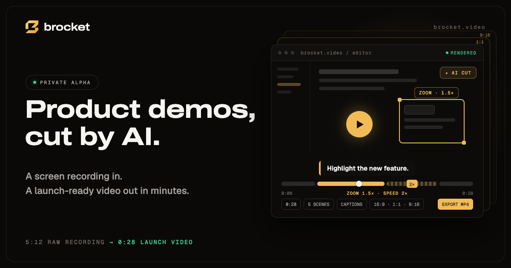

# brocket-landing

Landing page for **Brocket**, the guided product-video workspace from
[PGUP AI](https://github.com/pgup-ai).

[](https://brocket.video)

## What's here

The original animated landing page is deployed without design changes. The
deployment uses static HTML plus a small vanilla JavaScript driver so the page
can paint immediately without loading the original editor runtime:

```text
index.html                              # optimized animated landing page (deployed)
landing.min.js                          # minified scroll-animation driver (deployed)
source/Brocket Landing.dc.html          # original editable landing source
source/landing.js                       # readable source for landing.min.js
source/Brocket UX Audit Review.dc.html  # original UX audit source
source/support.js                        # source runtime
archive/codex-edited-index.html          # previous Codex edit; not deployed
vercel.json                              # static deployment configuration
robots.txt / sitemap.xml / llms.txt      # crawler + AI-engine (GEO) files
og-image.png                             # 1200x630 social preview (og:image), design export
favicon.svg / favicon-16/32/48.png / apple-touch-icon.png  # favicons (brand mark)
icon-192.png / icon-512.png / site.webmanifest  # PWA manifest icons
brand/                                   # brand asset sources (mark + icon SVGs, org avatar,
                                         #   github-social-preview.png for repo Settings)
```

Brand: gold `#F2BB55` (gradient `#F9D274 → #F1BC57 → #E3A231`), canvas `#0A0908`,
ink-on-gold `#141009`, lowercase `brocket` wordmark next to the 45°-grid mark.
Regenerate icons from `brand/` SVGs. `og-image.png` is a design export;
`brand/github-social-preview.png` derives from it (edge-extended to 1280x640).

`index.html` is a performance-oriented deployment derivative of the `.dc.html`
source. Keep visual or copy changes aligned between the two files. If the
animation logic changes, edit `source/landing.js` and regenerate
`landing.min.js`; do not restore the editor export wrapper around the deployed
page, because that wrapper delays first paint and reintroduces the React runtime.

## Develop

Serve the directory to exercise anchors and browser behavior:

```bash
python3 -m http.server 8000
```

Then open <http://localhost:8000>.

After editing the readable animation driver, rebuild the deployed file with:

```bash
npx --yes terser@5.49.0 source/landing.js --compress passes=2 --mangle --comments false --output landing.min.js
```

## Deploy

The site has no dependencies or build command. Vercel deploys every push to
`main` from [pgup-ai/brocket-landing](https://github.com/pgup-ai/brocket-landing)
to [brocket.video](https://brocket.video). Other branches receive preview
deployments.
